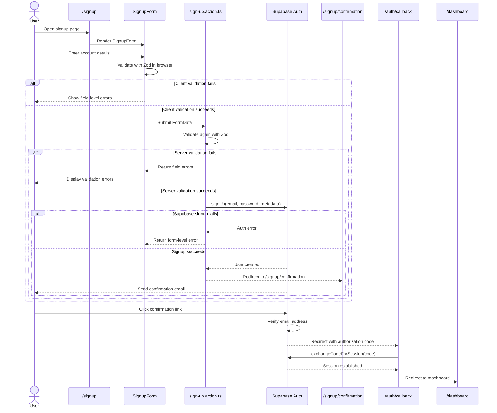
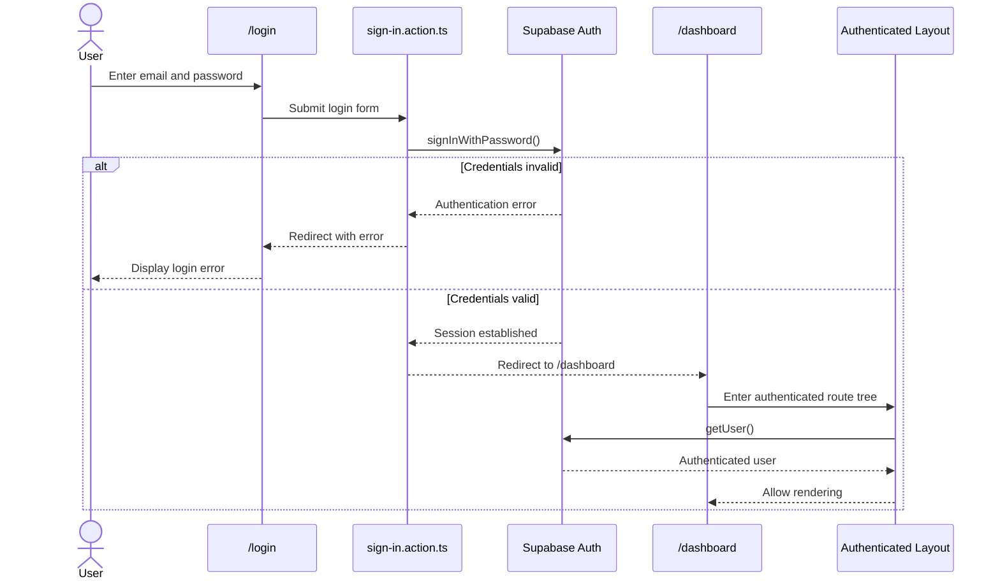
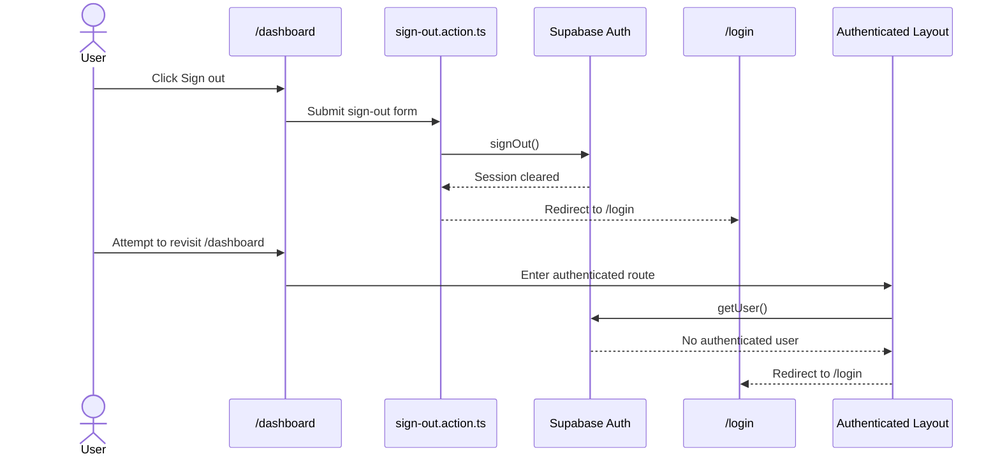

# Slice 2 — Authentication

## Goal

Add a complete authentication flow to CashLens using Supabase Auth while keeping the architecture simple and appropriate for a freelancer-friendly application.

By the end of this slice, CashLens supports:

- sign up
- first name and last name capture
- password confirmation
- client-side validation
- server-side validation
- email confirmation
- auth callback handling
- session establishment
- sign in
- protected authenticated routes
- sign out
- production deployment and testing

This slice also introduced several important Next.js 16 concepts that were not encountered in the earlier DocumentHub project.

---

## Final Authentication Flow

CashLens uses Supabase Auth for application authentication.

This is separate from the future QuickBooks OAuth integration.

Supabase Auth answers:

> Who is using CashLens?

QuickBooks OAuth will later answer:

> Which QuickBooks company has this CashLens user authorised CashLens to access?

Keeping those concerns separate will be important as the application grows.

---

# Signup

The signup page collects:

- first name
- last name
- email
- password
- confirm password

First name and last name are stored in Supabase Auth user metadata.

This gives CashLens enough information to later display user names and generated avatar initials without introducing a separate profile table prematurely.

Example:

```text
Willy Tjandra
WT
```

A dedicated profile table can be introduced later if the application needs editable profile information or richer user settings.

---

## Signup Sequence



---

# Shared Client and Server Validation

CashLens uses the same Zod schema on both the client and server.

The client-side validation exists for UX.

The server-side validation exists for security and correctness.

```text
User input
    ↓
React Hook Form
    ↓
Zod validation in browser
    ↓
Server Action
    ↓
same Zod schema
    ↓
authoritative server validation
    ↓
Supabase
```

Client validation cannot replace server validation because browser-side logic can be bypassed.

Using the same schema avoids maintaining two different sets of validation rules.

---

## React Hook Form

`SignupForm` uses React Hook Form with the Zod resolver.

Validation mode is:

```ts
mode: "onBlur";
```

This means validation feedback appears after the user leaves a field rather than immediately while typing.

This provides quicker feedback than waiting for submission without making the form overly aggressive.

---

## useActionState

The signup form also uses React's `useActionState`.

The action state is modeled as a discriminated union.

Conceptually:

```ts
type SignUpState =
  | {
      success: true;
      message: string;
    }
  | {
      success: false;
      errors: {
        firstName?: string[];
        lastName?: string[];
        email?: string[];
        password?: string[];
        confirmPassword?: string[];
        form?: string[];
      };
    };
```

This lets TypeScript safely determine which properties exist based on:

```ts
state.success;
```

rather than relying on a loose collection of optional properties.

---

## React Hook Form and useActionState

Originally, a native Server Action form could use:

```tsx
<form action={formAction}>
```

React Hook Form needs to intercept submission first so it can run client-side validation.

Therefore the form uses:

```tsx
<form onSubmit={onSubmit}>
```

The flow becomes:

```text
submit
  ↓
React Hook Form
  ↓
Zod client validation
  ↓
valid?
  ├── no → show errors
  └── yes → call Server Action
```

Because the action returned by `useActionState` is invoked manually rather than through a form `action` prop, it must run within a React transition:

```ts
startTransition(() => {
  formAction(formData);
});
```

Without the transition React reports:

```text
An async function with useActionState was called outside of a transition.
```

This is required so React can correctly track the pending state and action result.

---

# Email Confirmation

CashLens temporarily shares the `document-hub-staging` Supabase project.

Because of this, CashLens should not rely on the Supabase project's default Site URL.

Instead, CashLens explicitly supplies:

```ts
emailRedirectTo: `${process.env.NEXT_PUBLIC_SITE_URL}/auth/callback`;
```

Environment configuration:

```text
Local
NEXT_PUBLIC_SITE_URL=http://localhost:3000

Production
NEXT_PUBLIC_SITE_URL=https://cash-lens-eta.vercel.app
```

The corresponding callback URLs must also be configured as allowed redirect URLs in Supabase.

---

## Why the Email Link Still Uses Supabase

The email confirmation link itself initially points to Supabase.

Conceptually:

```text
Email link
    ↓
Supabase verification endpoint
    ↓
email verified
    ↓
CashLens callback
```

CashLens does not need a custom email-domain link for this flow.

Supabase verifies the confirmation token first and then redirects the browser to the application's configured `emailRedirectTo`.

---

# Auth Callback

The callback is implemented as a Next.js Route Handler:

```text
app/auth/callback/route.ts
```

It handles a `GET` request because the browser arrives at the endpoint through normal link navigation after email confirmation.

The callback receives an authorization code and exchanges it for the Supabase session:

```ts
supabase.auth.exchangeCodeForSession(code);
```

After the session has been established, the user is redirected to:

```text
/dashboard
```

A Route Handler does not require:

```ts
"use server";
```

because `route.ts` already executes server-side by definition.

---

# Login

CashLens uses a Server Action for login.

The high-level flow is:



Login remains intentionally simpler than signup.

It currently uses the URL query string for its page-level authentication error rather than introducing React Hook Form and `useActionState`.

This is acceptable because login does not currently require complex field-level validation.

---

# Protected Routes

Authenticated CashLens pages live under:

```text
app/
└── (authenticated)/
    ├── layout.tsx
    └── dashboard/
        └── page.tsx
```

The route group does not affect the public URL.

Therefore:

```text
app/(authenticated)/dashboard/page.tsx
```

maps to:

```text
/dashboard
```

The authenticated layout validates the Supabase session before allowing the route tree to render.

If no authenticated user exists:

```text
/dashboard
    ↓
authenticated layout
    ↓
no user
    ↓
/login
```

This creates one shared protection boundary for future authenticated CashLens features.

---

# Next.js Cache Components

CashLens enables:

```ts
cacheComponents: true;
```

This differs from DocumentHub and exposed several newer Next.js rendering concepts during Slice 2.

With Cache Components enabled, Next.js attempts to prerender as much of the route tree as possible.

Request-bound values cannot safely execute during prerendering.

Examples encountered during this slice include:

- `searchParams`
- `cookies()`
- Supabase session access
- runtime time-based logic such as `Date.now()`

---

## Login and `searchParams`

The login page reads:

```ts
searchParams;
```

to display authentication errors.

Initially this caused a production build error because `searchParams` is request-time state.

We first isolated the request-dependent UI behind Suspense.

Later, Instant Navigation validation created additional complexity when navigating back to `/login`.

Because the login page is small and inherently request-dependent, CashLens now explicitly marks it as blocking:

```ts
export const instant = false;
```

This is simpler than maintaining a tiny streamed component solely for the login error message.

---

## Authenticated Layout

The authenticated route tree depends entirely on request-time session cookies.

Therefore the layout uses:

```ts
export const instant = false;
```

This tells Next.js that navigation to the authenticated area may block while the route is rendered.

However, this alone was not sufficient.

After email confirmation, Supabase session processing caused Next.js to encounter:

```text
Date.now()
```

during prerendering.

The application therefore also uses:

```ts
await connection();
```

before session-dependent logic.

Conceptually:

```text
authenticated layout
       ↓
await connection()
       ↓
real incoming request exists
       ↓
read Supabase cookies/session
       ↓
getUser()
       ↓
allow or redirect
```

The distinction is useful:

```text
instant = false
→ navigation may block while request-time work completes

connection()
→ everything after this point requires a real request
```

For authenticated routes, using both is appropriate because authentication fundamentally depends on request-time state.

---

# Sign Out

CashLens uses a Server Action for sign-out.



---

## Server Action vs Route Handler for Sign Out

DocumentHub used a POST Route Handler for sign-out.

Its flow was approximately:

```text
POST /auth/signout
    ↓
inspect auth claims
    ↓
Supabase signOut()
    ↓
revalidate layout
    ↓
redirect
```

CashLens deliberately uses a Server Action instead.

The CashLens sign-out operation is currently:

- initiated only from React UI
- triggered by a form submission
- a simple server-side mutation
- not required as a standalone HTTP API endpoint

Therefore:

```text
<form action={signOut}>
```

is sufficient.

This keeps the implementation smaller and avoids introducing an endpoint that the application does not currently need.

If CashLens later requires sign-out to be called independently from the React UI, a Route Handler could be introduced.

The important lesson is that neither approach is universally better.

Choose based on how the operation is consumed.

---

# Folder Structure

The authentication-related structure after Slice 2 is approximately:

```text
app/
├── auth/
│   └── callback/
│       └── route.ts
├── login/
│   ├── page.tsx
│   └── sign-in.action.ts
├── signup/
│   ├── components/
│   │   └── SignupForm.tsx
│   ├── confirmation/
│   │   └── page.tsx
│   ├── page.tsx
│   ├── sign-up.action.ts
│   └── sign-up.schema.ts
└── (authenticated)/
    ├── layout.tsx
    ├── sign-out.action.ts
    └── dashboard/
        └── page.tsx
```

The structure intentionally keeps feature-specific files close to the routes that use them.

---

# Coding Conventions Introduced

Slice 2 established the first CashLens coding conventions.

These are documented separately in:

```text
CODING_STANDARDS.md
```

Key conventions introduced include:

- one Server Action per file
- Server Action filenames use kebab-case and `.action.ts`
- one React component per file
- React component filenames use PascalCase
- route-specific components live under the route's `components/` directory
- preserve Next.js reserved filenames such as `page.tsx`
- components inside `page.tsx` use a descriptive name ending in `Page`
- reuse the same Zod schema for client and server validation
- prefer discriminated unions for meaningful action states

---

# Key Differences from DocumentHub

DocumentHub established the basic Supabase Auth concepts.

CashLens reused those foundations but extended the learning in several areas:

| Area              | DocumentHub                | CashLens                                      |
| ----------------- | -------------------------- | --------------------------------------------- |
| Signup fields     | Email + password           | Name + email + password + confirmation        |
| Client validation | Basic                      | React Hook Form + Zod                         |
| Server validation | Manual                     | Shared Zod schema                             |
| Signup errors     | Simple state               | Field-level typed state                       |
| Email redirect    | Supabase Site URL fallback | Explicit application callback                 |
| Auth callback     | Simpler/default flow       | Explicit code-for-session exchange            |
| Sign out          | POST Route Handler         | Server Action                                 |
| Cache Components  | Not enabled                | Enabled                                       |
| Request rendering | Conventional SSR           | `instant`, `connection`, prerender boundaries |
| Coding standards  | Informal                   | Explicit `CODING_STANDARDS.md`                |

---

# What Slice 2 Taught

The most important learning from this slice was not basic authentication itself.

That was already understood from DocumentHub.

The new learning was how authentication interacts with a more production-oriented Next.js application:

- designing richer form validation
- sharing schemas across browser and server
- using React Hook Form with Server Actions
- understanding `useActionState`
- distinguishing UI mutations from HTTP Route Handlers
- explicitly controlling email confirmation redirects
- establishing Supabase SSR sessions from callbacks
- understanding Cache Components and request-time rendering
- choosing between streaming and blocking routes
- using `connection()` when a route fundamentally requires a real request

These concepts will become particularly important when CashLens introduces QuickBooks OAuth and background financial data synchronisation.

---

# Slice 2 Complete

Slice 2 is complete when the following work locally and in the deployed Vercel application:

- user can sign up
- client validation provides immediate feedback
- server validates submitted data
- Supabase sends confirmation email
- confirmation returns to CashLens
- callback establishes the session
- authenticated user can access `/dashboard`
- unauthenticated user cannot access `/dashboard`
- existing user can sign in
- authenticated user can sign out
- signed-out user cannot reopen protected routes
- `pnpm build:prod` passes
